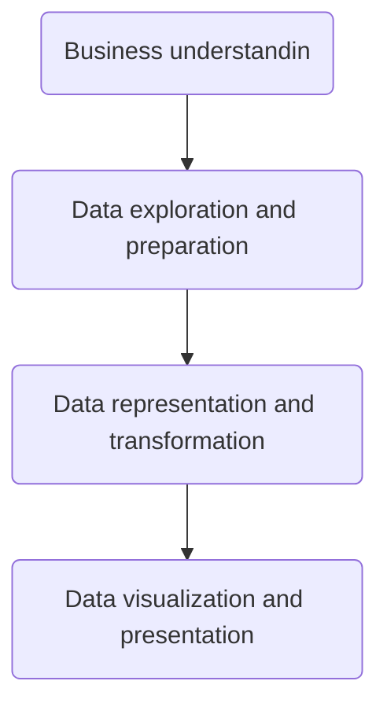

# Adventure work Bussiness Intelligence Reports - Interactive-Dashboard-Using-Power-BI
- **Adventure work's Bussiness Intelligence Reports** is part of assingment for Microsoft Power BI Desktop for Business Intelligence (2023) taught by Maven Analytics, Chris Dutton, Aaron Parry on Udemy.

> [!NOTE]
> Course is availbe on [Udemy Platform] (https://www.udemy.com/course/microsoft-power-bi-up-running-with-power-bi-desktop/). I took the course as part of [Programme in Data Analytics | IBM | SkillUp | 2023 availble on] (https://skills.yourlearning.ibm.com/activity/PLAN-140B7B12702D?focuslmsId=UDEMY-937678)
> 
> Data provided by the **Maven Analytics** at DOWNLOAD: Course Resources lecture section.

> [!IMPORTANT]
> For privecy concerns I mask any personal info.

> [!Tip]
> Since any app on [Power Platform](https://www.microsoft.com/en-us/power-platform/products/power-bi/) including Power BI needs to upgrade to **Power BI Pro** or **Power BI Premium** to share reports, and I work on [Power BI desktop ](https://powerbi.microsoft.com/en-us/desktop/), I had to just publish the result as PDF format.
> 
> For sharing code I also needed [GitHub template app](https://learn.microsoft.com/en-us/power-bi/connect-data/service-connect-to-github) wich is unavailble for my scheme I am looking for a solution to add my DAX and M code here until then I just add whole project here.
