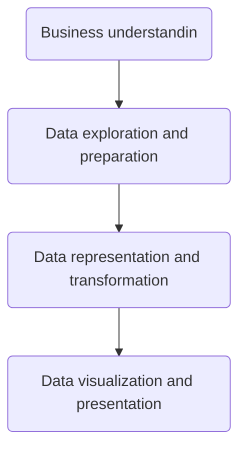

# Adventure Works Bussiness Intelligence Reports
## Interactive-Dashboard-Using-Power-BI: Transforming Data into Business Insights.

# 📝 Table of Contents
- [About](#about)
- [Demo](#demo)
- [Business Understanding](#workflow)
- [Data Understanding](#data_undestanding)
- [Approach](#approach)
- [Database Model Diagram](#database)
- [Status](#status)
- [Credits](#credits)
## About 
**Adventure works Bussiness Intelligence Reports** is part of assingment for Microsoft Power BI Desktop for Business Intelligence (2023) taught by Maven Analytics, Chris Dutton, Aaron Parry on Udemy. I Transformed Data into Business Insights for Adventure Works. 
This interactive dashboard includs:
### Unlocking Key Sales Performance with the Executive Dashboard:

This high-level view focuses on the top 10 products, providing critical insights into their performance through:

- **Sales Leaderboard:** Instantly identify the most impactful products based on orders and revenue. 
- **Return Rate Analysis:** Gain visibility into potential product issues or optimization opportunities. 
- **Target Tracker:** Breathe easy knowing you're on top of sales goals. The dashboard dynamically calculates monthly targets based on past performance, providing a clear measure of success. 

Dive Deeper with Granular Insights: Empower business sponsors with drill-down functionality, allowing them to:

- **Explore product details:** Analyze individual product performance beyond the top 10.
- **Understand trends:** Drill down into specific periods to uncover sales fluctuations and return patterns.
- **Investigate returns:** Gain insights into the reasons behind product returns, enabling informed decision-making.
- **Dynamic Targets for Proactive Management:** Stay ahead of the game with ever-evolving sales targets.
The dashboard automatically adapts goals based on previous months' performance, ensuring you set realistic yet ambitious objectives.

**Value Delivered:**

- **Actionable insights:** Quickly identify sales leaders and potential performance issues.
- **Data-driven decision-making:** Base your strategies on objective performance data.
- **Target awareness:** Monitor progress towards dynamic sales goals, ensuring accountability and focus.
- **Drill-down capabilities:** Deep dive into specific products and timeframes for further analysis.
  
## Demo 
For viewing a sample of result please check here https://github.com/masumesani/Interactive-Dashboard-Using-Power-BI/blob/main/AdventureWorkDashboard.pdf

## Business Understanding 
As a Business Intelligence Analyst for Adventure Works Cycles, I want to transform raw data into professional-quality reports and dashboards. This will enable me to track Key Performance Indicators (KPIs), compare regional performance, analyze product-level trends, and identify high-value customers.  

**Overview** 
Adventure Works operates in a dynamic landscape with diverse territories, a rich product portfolio, and a customer base with unique preferences. Each territory holds varying sales potential, each product category caters to specific needs, and understanding customer buying patterns is crucial for success. 

**Challenges and Opportunities:**

Navigating this complex landscape presents challenges. Optimizing sales across territories, ensuring product offerings align with customer demand, and addressing potential issues reflected in returns all require deep insights. However, these challenges also bring tremendous opportunities. Data-driven analysis of Adventure Works unlocks the potential to:

- **Maximize territorial sales:** Identify high-performing areas, understand regional nuances, and tailor strategies for optimal sales growth. 
- **Boost product profitability:** Uncover popular product categories, analyze sales trends, and make informed decisions about product development and promotion. 
- **Enhance customer satisfaction:** Gain insights into customer demographics, buying habits, and potential return triggers, allowing for targeted marketing, improved product offerings, and proactive customer service. 
- **Optimize operational efficiency:** Analyze sales data and return patterns to identify areas for cost reduction and efficiency improvements. 
- **Predict future trends:** Leverage historical data and emerging market signals to anticipate shifts in customer preferences and prepare for future success. 

>[!NOTE]
> For more information about detailed steps and phase please check project documentation here: https://github.com/masumesani/Interactive-Dashboard-Using-Power-BI/blob/main/Documentation.md#user-story

## Data Understanding 
To explore and analyze various business scenarios, we will be using a simulated dataset provided Maven Analytics. This dataset, divided into sales (56,046 entries), returns (1,809 entries), and products (293 entries), offers valuable insights for learning purposes. Remember that the data is accessible within this course.
### Unveiling the Keys:
- **Sales data**: Region ,Order date, Stock date, Order number, Customer key,Product key, Territory key, Order line item. 
- **Customer data**: Customer key, Annual iIncome, Birth date, Name, Education level, Education category Email address, Gender, Home ownership status, Marital status, Occupation, Total children. 
 - **Product data**: Product key, Product category, Product subcategory, Product name, Product model name, Product description, Product color, Product price. 
 - **Return data**: Product key, Return date, Return quantity, Territory key. 
 - **Calendar look-up**  
 - **Territory_Lookup** : Sales territory key, Region, Country, Continent. 
 
This project embarks on a journey to unlock the secrets behind Adventure Works, a rich repository of diverse data encompassing:  
- **Territorial Landscapes:** Gain nuanced understanding of sales performance across different market areas with the territory look-up. 
- **Temporal Insights:** Navigate the calendar look-up to uncover trends and seasonality patterns within sales data. 
- **Customer Centricity:** Unravel customer behavior and preferences with the customer look-up, revealing valuable demographics and purchase history. 
- **Product Powerhouse:** Dive deep into product performance with the product look-up, product subcategory look-up, and product category look-up, uncovering popular offerings and potential areas for optimization. 
- **Sales Success Stories:** Analyze sales figures and identify key drivers of revenue using the sales data. 
- **Return Reflections:** Gain insights into customer returns with the return data, potentially revealing product issues or opportunities for improvement. 

## 🗄️ Database Model Diagram 
Check the DB Model Diagram here https://dbdiagram.io/d/Adventure-Work-657f111756d8064ca02ecfe3

## Approach and Technologies 

Empowering data-driven decisions, developed a comprehensive Business Intelligence dashboard using Power BI. 
- **Utilizing Power Query** for seamless data acquisition and transformation,
- **DAX** for insightful calculations and measure, and
- **M** for advanced data manipulation,
- **Integrated data modeling** (snowflake schema),
- **Robust statistical analysis**,
- **Interactive reporting** to provide a holistic view of business performance.Given stakeholders can now confidently navigate dynamic reports, gleaning critical insights to make informed choices.

To bring data to life and implement an effective, actionable insight following steps of data science methodology were taken: 

## Status <a name="status"><a/>
Compeleted.
## Credits 
Course is availbe on [Udemy Platform] (https://www.udemy.com/course/microsoft-power-bi-up-running-with-power-bi-desktop/). I took the course as part of [Programme in Data Analytics | IBM | SkillUp | 2023 availble on] (https://skills.yourlearning.ibm.com/activity/PLAN-140B7B12702D?focuslmsId=UDEMY-937678)
Data provided by the **Maven Analytics** at DOWNLOAD: Course Resources lecture section.

> [!IMPORTANT]
> For privecy concerns I mask any personal info.

> [!Tip]
> Since any app on [Power Platform](https://www.microsoft.com/en-us/power-platform/products/power-bi/) including Power BI needs to upgrade to **Power BI Pro** or **Power BI Premium** to share reports, and I work on [Power BI desktop ](https://powerbi.microsoft.com/en-us/desktop/), I had to just publish the result as PDF format.
> 
> For sharing code I also needed [GitHub template app](https://learn.microsoft.com/en-us/power-bi/connect-data/service-connect-to-github) wich is unavailble for my scheme I am looking for a solution to add my DAX and M code here until then I just add whole project here.
